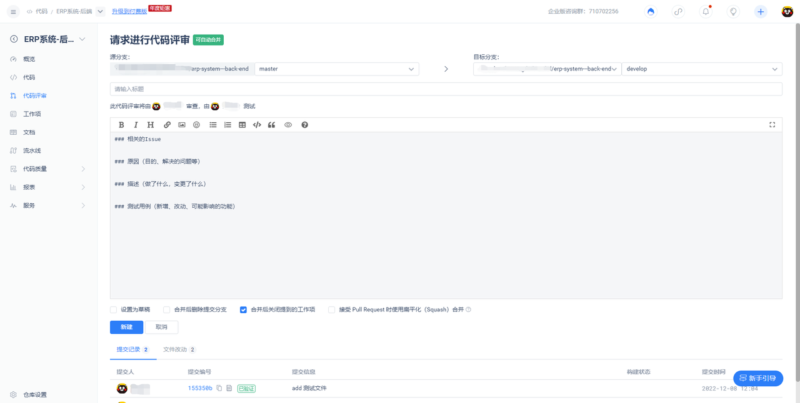
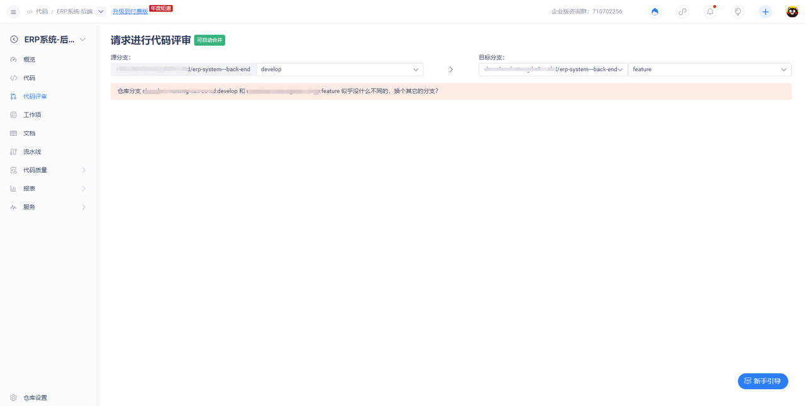
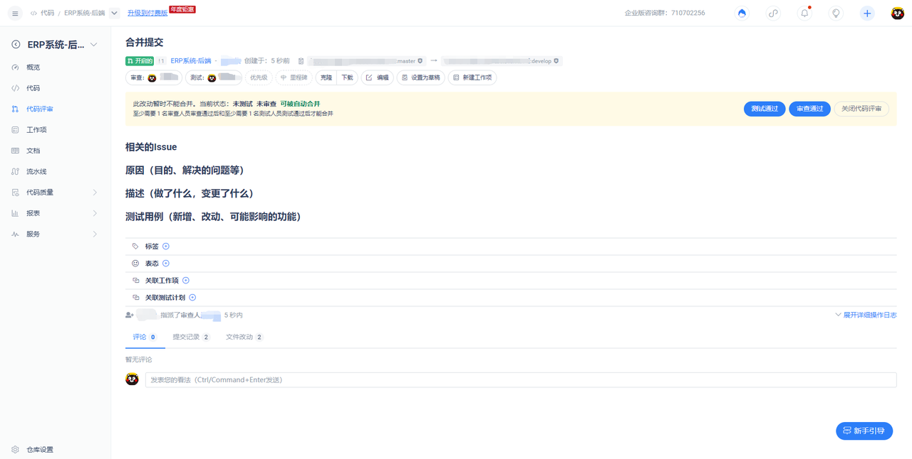
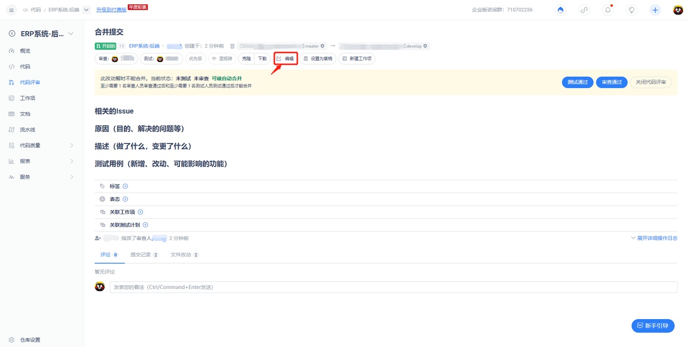
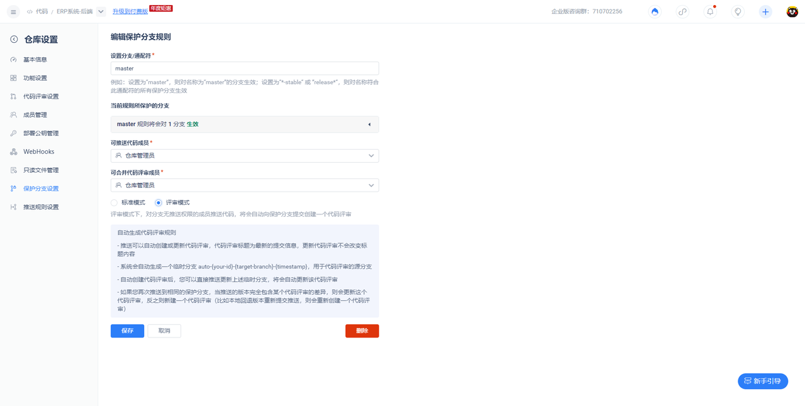
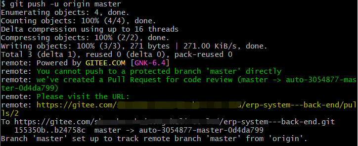
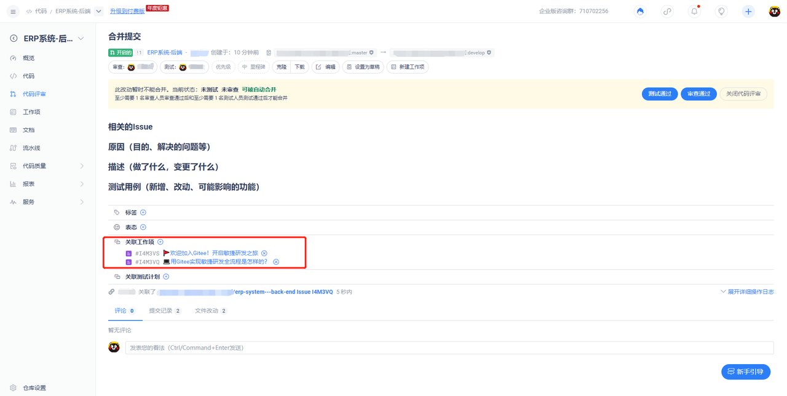
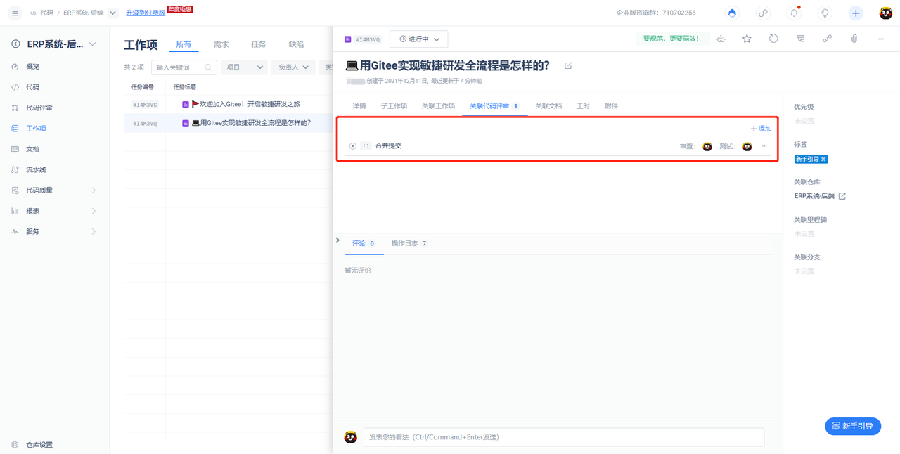
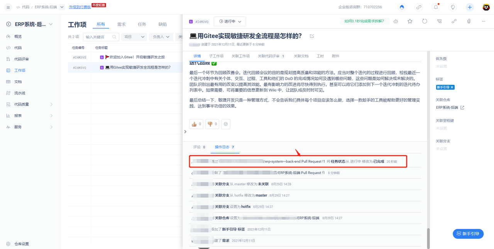

# 示例仓库

示例仓库内包括：

- 快速开始指南

- Gitee推荐的代码协作开发模式

- 如何运用Gitee企业版结合项目管理和代码协作

## 一、快速开始

如果你已经是Git的熟练使用者，直接使用下面的地址来连接远程仓库：

`git@gitee.com:a-com/sample_repository.git`

我们强烈建议所有的Git仓库都有一个 README, LICENSE, .gitignore文件。

详细的教程请查看：

1、[Git入门](https://gitee.com/help/articles/4114)

2、[Visual Studio](https://gitee.com/help/articles/4118) / [TortoiseGit](https://my.oschina.net/longxuu/blog/141699) / [Eclipse](https://gitee.com/help/articles/4119) / [Xcode](https://my.oschina.net/zxs/blog/142544)下如何连接Gitee

3、[个人和组织的Gitee仓库如何导入企业](https://gitee.com/help/articles/4155)

**简易的命令行入门教程**

1、命令行进行本地 Git 全局设置（yourname = Gitee中的用户名，your@email.com = 在Gitee中绑定的邮箱）: 

```
git config --global user.name "yourname"
git config --global user.email "your@email.com"
```

2、命令行本地创建 Git 仓库并推送到 Gitee 远程仓库（repo_name即为Git仓库所在的文件夹名称）:

```
mkdir repo_name
cd repo_name
git init
touch README.md
git add README.md
git commit -m "first commit"
git remote add origin https://gitee.com/your_enterprise_name/test_repository.git
git push -u origin master
```
3、命令行推送本地已有 Git 仓库到 Gitee 远程仓库（repo_name即为Git仓库所在的文件夹名称）：

```
cd repo_name
git remote add origin https://gitee.com/your_enterprise_name/test_repository.git
git push -u origin master
```

## 二、多种协作开发模式
### 1、非本团队内项目的协作开发模式：Fork + Pull Request
Gitee 中的跨项目开发协作，最常用和推荐的方式是“Fork + Pull Request”模式。在“Fork + Pull Request”模式下，仓库参与者不必向仓库创建者申请提交权限，而是在自己的托管空间下建立仓库的派生（Fork）。至于在派生仓库中创建的提交，可以非常方便地利用 Gitee 的 Pull Request 向原始仓库的维护者发送 Pull Request。

### 2、本团队内项目的协作开发模式：保护分支规则 + Change Request
Gitee中本团队的项目开发协作，可以通过保护分支规则控制项目内成员对分支的推送及合并权限，并通过评审模式（Change Request），达到每次新推送即自动创建Pull Request或更新现有Pull Request对代码进行评审的质量把控，规范线上代码协作流程。

### 3、如何 fork 仓库

fork 仓库时非常简单的，进到仓库页面，然后找到右上角的 fork 按钮，点击后选择 fork 到的命名空间，再点击确认，等待系统在后台完成仓库克隆操作，就完成了 fork 操作，如图：


### 4、什么是 Pull Request？

Pull Request 是两个仓库 或 同仓库内不同分支 之间提交变更的一种途径，同时也是一种非常好的团队协作方式，常用于团队的代码审查等场景。下面，就来讲解如何在 Gitee 平台提交 Pull Request。

#### 4.1、如何提交 Pull Request

首先，您的仓库与目标仓库必须存在差异，这样才能提交,比如这样：


如果不存在差异，或者目标分支比你提Pull Request的分支还要新，则会得到这样的提示：


然后，填入Pull Request的说明，点击提交Pull Request，就可以提交一个Pull Request了，就想下图所示的那样：


#### 4.2、如何对已经存在的 Pull Request 的进行管理

首先，对于一个已经存在的 Pull Request，如果只是观察者，报告者等权限，那么访问将会受到限制，具体权限限制请参考 Gitee 平台关于角色权限的内容，下文涉及的部分，仅针对管理员权限，如果您发现不太一样的地方，请检查您的权限是不是管理员或该 Pull Request 的创建者。

#### 4.3、如何修改一个已经存在的 Pull Request

点击 Pull Request 的详情界面工具栏的编辑按钮，就会弹出编辑框，在编辑框中修改你需要修改的信息，然后点击保存即可修改该 Pull Request，如下图所示：



请注意，在该界面，可以对 Pull Request 进行指派负责人，指派测试者等等操作，每一个操作均会通知对应的人员

#### 4.4、对 Pull Request 的 bug 修改如何提交到该 Pull Request 中

对于 Pull Request 中的 bug 修复或者任何更新动作，均不必要提交新的 Pull Request，仅仅只需要推送到您提交 Pull Request 的分支上，稍后我们后台会自动更新这些提交，将其加入到这个 Pull Request 中去

#### 4.5、Pull Request 不能自动合并该如何处理

在提交完 Pull Request 的后，在这个 Pull Request 处理期间，由原本的能自动合并变成不能自动合并，这是一件非常正常的事情，那么，这时，我们有两种选择，一种，继续合并到目标，然后手动处理冲突部分，另一种则是先处理冲突，使得该 Pull Request 处于可以自动合并状态，然后采用自动合并，一般来讲，我们官方推荐第二种，即先处理冲突，然后再合并。具体操作为：

先在本地切换到提交 Pull Request 的分支，然后拉取目标分支到本地，这时，会发生冲突，参考如何处理代码冲突 这一小节将冲突处理完毕，然后提交到 Pull Request 所在的分支，等待系统后台完成Pull Request的更新后，Pull Request 就变成了可自动合并状态

#### 4.6、Pull Request 不小心合并了，可否回退

对于错误合并的 Pull Request，我们提供了回退功能，该功能会产生一个回退 XXX 的 Pull Request，接受该 Pull Request 即可完成回退动作，注意，回退本质上是提交一个完全相反的 Pull Request，所以，你仍然需要进行测试来保证完整性，另，为了不破坏其他 Pull Request，建议只有需回退的 Pull Request 处于最后一次合并操作且往上再无提交时执行回退动作，否则请手动处理。

### 5、如何设置保护分支规则

「保护分支」是 Gitee 针对团队协作中代码权限管理的功能，即为了减小成员误操作带来的损失，对一些关键的分支进行保护，防止被破坏。保护以后，只有仓库的管理员才能对这个分支进行修改、合并等操作。

「Change Request」 是由 Gerrit 推出的一个概念，Gerrit 是为 AOSP（Android Open Source Project）写的，结合 Repo 工具用来管理庞大的安卓项目，多仓管理也是他的优势之一，但是更多的人把它视为代码评审神器，能够使每一个Commit 都是可靠。这种模式同样需要严格管控目标分支的写权限，开发者可以在本地起一个分支进行开发。

与 Pull Request 不同的是，Change Request 不需要开发者到 Web 上进行评审请求的提交，推送一个 Commit 到对应的分支之后，会自动创建一个评审单。而且另外一个比较大的区别就是，Change Request 的评审是针对单 Commit 评审，而 Pull Request 针对的是一个或者多个 Commit 的集中评审。

如何设置Change Request（评审模式）：



向目标保护分支推送即创建Pull Request



## 三、项目管理与协作开发相结合
在Gitee企业版中，可以创建【项目】和【工作项】。采用 Pull Request / Change Request模式进行协作的团队，可以将代码推送与任务提交进行很好的结合。

通过 Pull Request 关联 Issue（也就是企业版中的【工作项】），用户可以在关闭 Pull Request 的时候同时关闭 issue。关联功能具有以下特点：

a. 一个 PR 可以关联多个 issue，例如同时关联 issue1 , issue2 格式为：#issue1ident, #issue2ident。
b. PR关联issue后，issue的状态会自动更改为进行中，当PR被合并后，issue会更改为关闭状态。
c. 个人版和企业版的区别： 
> - 个人版，PR只能关联当前仓库的任务 
> - 企业版，PR可以关联所有企业的任务。

### 1.具体通过Pull Request 关联 Issue操作如下：
#### 1.1、在 pr 的内容里面指定需要关闭的 工作项 ，例如：


#### 1.2、 在 工作项 详情页可以看到关联关系



#### 1.3、 当 PR 合并之后其关联的 工作项 被关闭



更多功能等待你来体验，快新建一个属于你自己的代码库开始探索吧！
进一步了解更多？请参看 [帮助中心](https://gitee.com/help)。